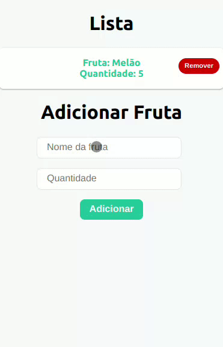

  

# 🚀 Projeto de Estudos de Redux & React 📚

## Bem-vindos ao Meu Playground Redux-React! 🎉

Ei, pessoal! Aqui está o meu espaço de aprendizado para dominar a dança de Redux com React. Este é um projeto cheio de desafios, experimentos e um toque de mágica do Redux.

## O Que Estamos Explorando 🌟

Nosso objetivo é mergulhar de cabeça no universo do gerenciamento de estado com Redux e sua harmonia com o React. Estamos aprendendo a sincronizar, despachar e criar magia com reducers, actions e stores.

## Tecnologias no Palco 🛠️

- **JavaScript:** 🟨 Linguagem base para todo o espetáculo.
- **React:** ⚛️ Nosso palco principal para construir interfaces encantadoras.
- **Redux:** 🔄 O maestro por trás do gerenciamento de estados.

## Funcionalidades nos Bastidores ✨

- **Redux Store:** Guardando nossos truques e segredos de estado.
- **Actions & Reducers:** Criando e executando nossos movimentos coreografados.
- **React Components:** Nossos artistas, criando performances impressionantes.

## Como Participar do Show 🎭💻

1. **Clone o Repositório:** `https://github.com/tiagoskaterock/react-estudos-redux`
2. **Instale as Dependências:** `npm install` ou `yarn install`
3. **Comece a Explorar:** Execute `npm start` ou `yarn start` para iniciar a experiência.

## Contribuições e Feedback 🤹‍♂️📢

Este projeto é um espetáculo coletivo! Se quiser contribuir com novos passos de dança, ajustes de iluminação ou apenas bater palmas, fique à vontade! Todo tipo de feedback e contribuição é bem-vindo para deixar nosso show ainda mais incrível.

Preparem-se para um espetáculo cheio de aprendizado, diversão e muito Redux & React! 🎪🎩✨

  

